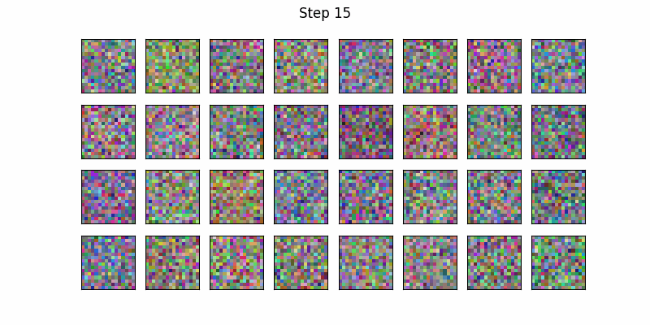

# How Diffusion Models Work - Experimentation Repo

This repo contains my code and experiments from the [How Diffusion Models Work](https://www.coursera.org/learn/how-diffusion-models-work-project/) course by DeepLearning.AI.

### First results
These images are obtained with 500 steps of unconditional model trained with DDPM.
